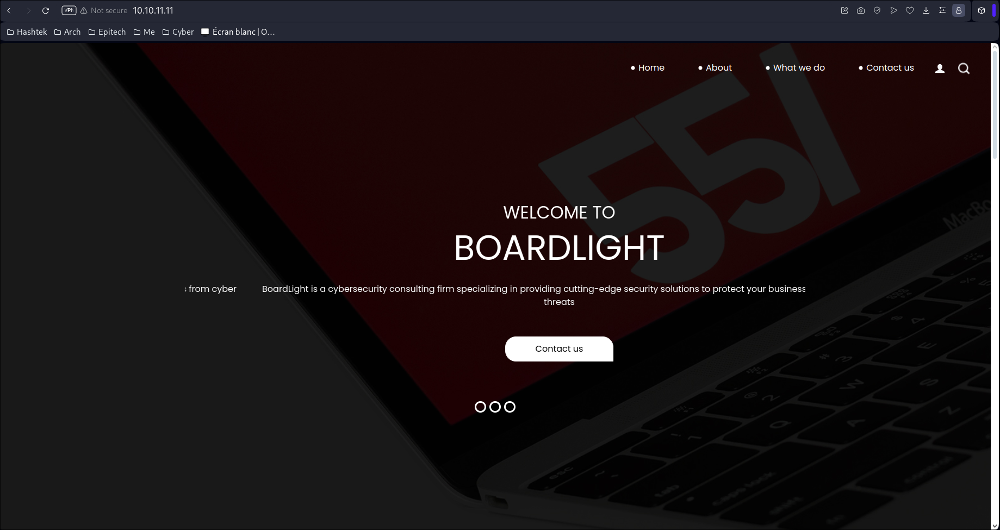

## BoardLight
You can find the machine [here](https://app.hackthebox.com/machines/BoardLight).
During all this writeup, I'll be using the variable `$TARGET` as the machine IP address, and `$ATTACKER` as the attacker IP address (us).

## Step 1 - Recognition

First of all, I will do some recognition using nmap without any flag to discover the top 1000 opened ports on the VM :

Here, I have the port 22 (as always) and the port 80, which is an http server :

At the end of the page, I can find the domain name of the server :

In our `/etc/hosts` file, I can add it for later. 

### Step 2 - Exploit

#### Flag user.txt
We can analyse the subdomains of the website with `ffuf` :

I found the subdomain `crm`. I can add it to our `/etc/hosts` file and try to go on http://crm.board.html. I found a login page :

This login page uses a CMS named "Dolibarr" on the version 17.0.0. I try to find some exploits on this version and finally found a [RCE](https://www.swascan.com/security-advisory-dolibarr-17-0-0/) that require authentication. So I try to search for the default credentials on the website, and found `admin:admin`, and it works.

I go back to the exploit I found previously, which is simply executing some PHP code, but I dont have the permissions to :

I try to change `<?php` to `<?PHP` and it works :

We can replace the code to a reverse-shell :

On the VM, I found a configuration file at `/var/www/html/crm.board.htb/htdocs/conf/conf.php` with a password :

In the `/home` directory, I found a user `larissa`. I try to connect to SSH using the credentials found :

The user.txt flag is in the `/home/larissa` directory.

#### Flag root.txt

I execute linpeas on the VM and found a list of potentially vulnerable binaries :

I search on Google for `enlightenment` exploits and found a [POC on github](https://github.com/MaherAzzouzi/CVE-2022-37706-LPE-exploit).
I try it, and obtain the root.txt flag.