# PermX
You can find the machine [here](https://app.hackthebox.com/machines/PermX).
During all this writeup, I'll be using the variable `$TARGET` as the machine IP address, and `$ATTACKER` as the attacker IP address (us).

## Step 1 - Recognition

First of all, we will do some recognition using nmap with the flag `-p-` to discover all the opened ports on the VM :
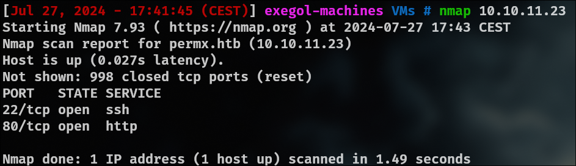

I found an HTTP server which redirect me to `http://permx.htb` :
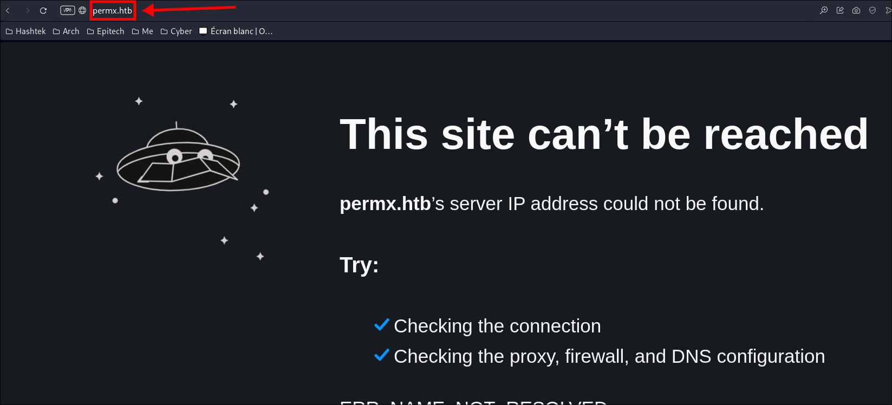

I add it to my `/etc/hosts` file and go back to the website :

I search for subdomains using `ffuf` and found the subdomain `lms` :
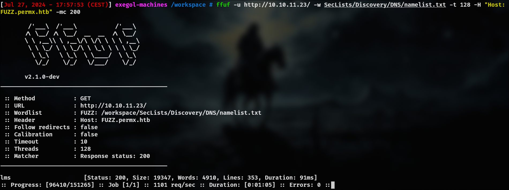

I add it to my `/etc/hosts` and go to the website. I found a login page :
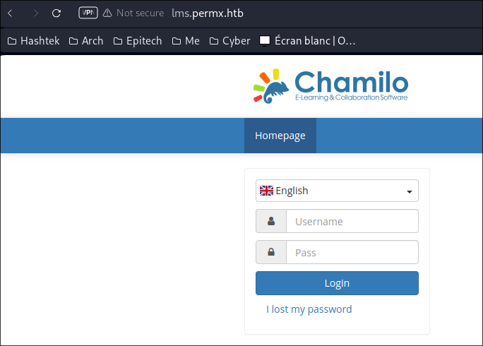

I found that the website use a CMS called `Chamilo`. I search for exploits and found an exploit that does not require authentication :
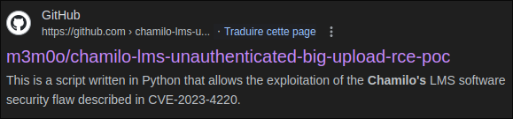

I clone the repository and use the exploit to get a reverse-shell :
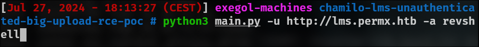
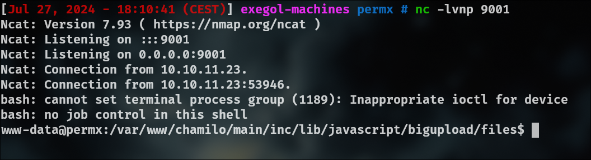

I run linpeas and find a password in a configuration file of the application :
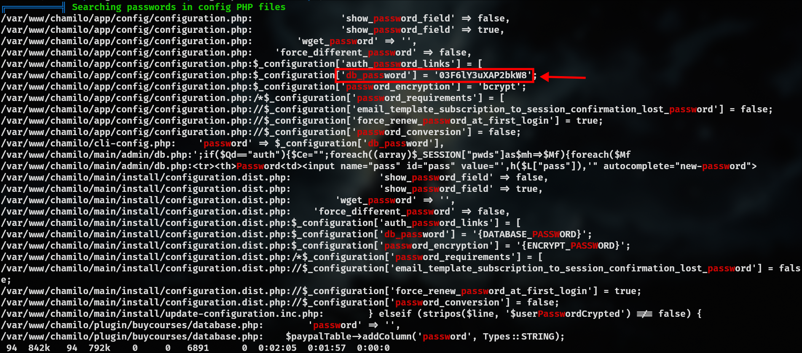

I search for a user in the `/home` directory and find the user `mtz`. I try to log in with SSH with the credentials found previously `mtz:03F6lY3uXAP2bkW8` :
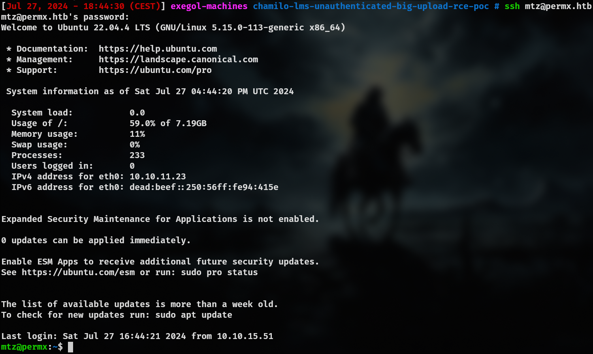

And I can finally get the `user.txt` flag.
#### Flag root.txt

I execute the command `sudo -l` to see what command I can execute without password and find a script :
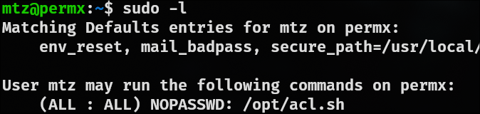
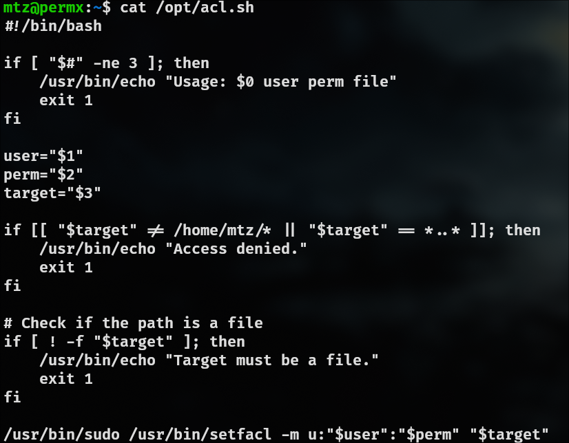

This script allow a user to change its permissions on a file. But the script has some protections, such as that the target file cannot be in another directory than `/home/mtz`, or that the target file cannot be a directory.

To exploit the script, I will use symbolic links *(= shotcuts)* to allow me to edit a file that is not in the `/home/mtz` directory.

Here is the plan :

1. We create a symlink to the `/etc/passwd` file.
2. We give permissions to `mtz` to edit this file.
3. We add a new user equivalent to the `root` user by adding a new line in this file.

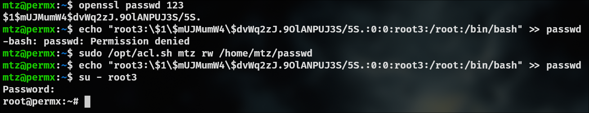

⚠️ Warning : Do not forget to add  `\\` before each `§` when adding the new line in the `passwd` file, as without it, the `$` will be interpreted. ⚠️

And I can finally get the flag root.txt.